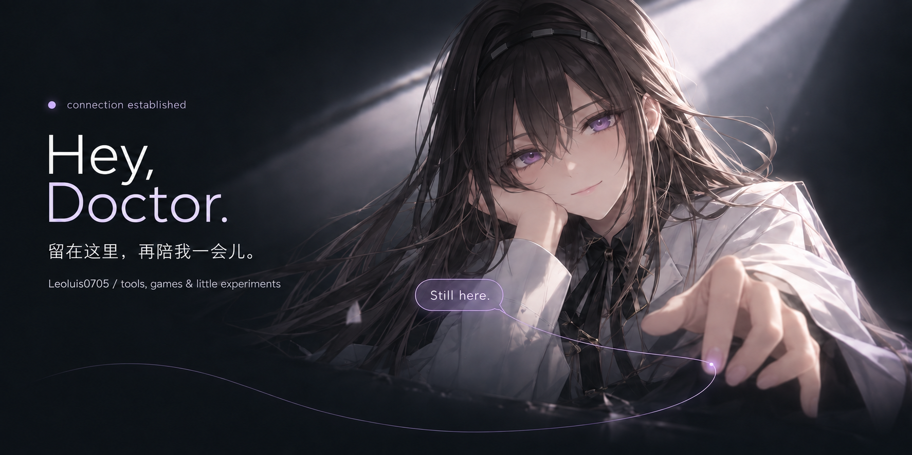
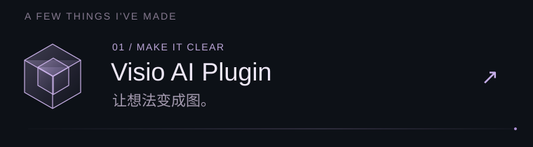
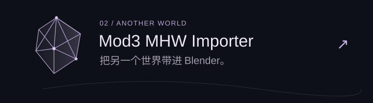

  
  

  
   
  

  <a href="https://github.com/Leoluis0705/Visio-ai-plugin">Visio AI Plugin ↗</a> &nbsp; · &nbsp;
  <a href="https://github.com/Leoluis0705/Mod3-MHW-Importer">Mod3 MHW Importer ↗</a> &nbsp; · &nbsp;
  <a href="https://github.com/Leoluis0705?tab=repositories">All projects ↗</a>

A little more about this corner / 关于这里

你好，我是 **才好的结果 / Leoluis0705**。

这里放着我的工具、游戏相关项目，以及一些用代码实现的想法。

- **[Visio AI Plugin](https://github.com/Leoluis0705/Visio-ai-plugin)** — 用 AI 创建与编辑 Microsoft Visio 图表，支持多模型与主题。
- **[Mod3 MHW Importer](https://github.com/Leoluis0705/Mod3-MHW-Importer)** — 面向 Blender 的《怪物猎人：世界》Mod3 导入插件，支持角色分体部件。

*Take your time.*

Priestess / 普瑞赛斯 · Arknights fan theme. AI-generated fan artwork; character belongs to its respective rights holders.

